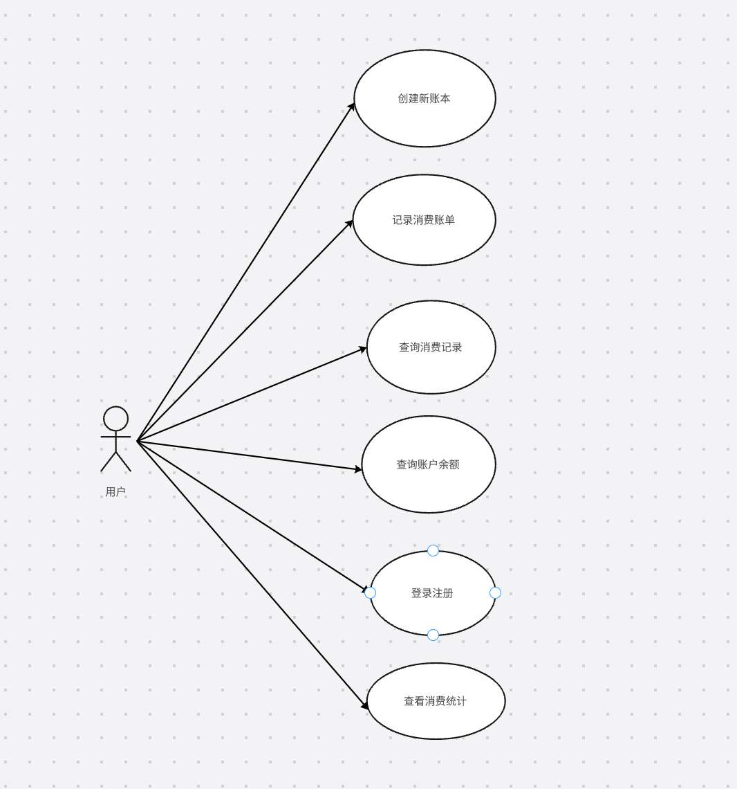
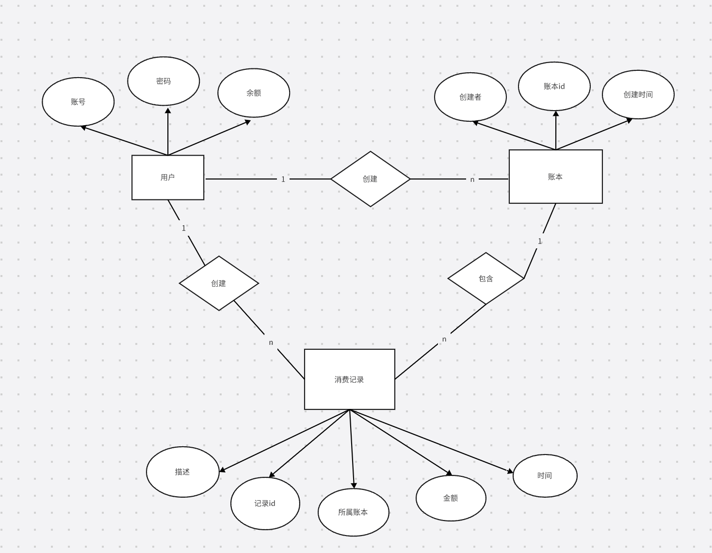
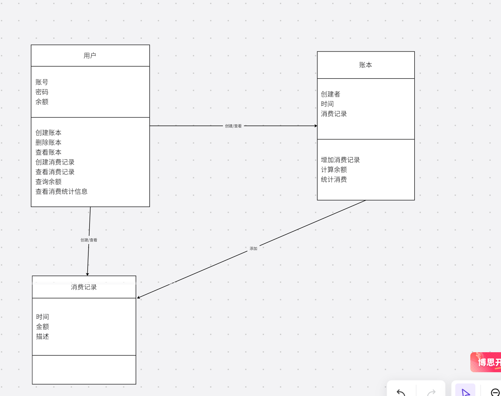

## 产品描述
	我们小组决定以手机应用的方式实现我们的账本app开发。在项目管理上使用github平台对代码和资源文件进行管理。我们的基本目标为实现一个面向年轻用户群体的账本软件。

## 产品功能
	应用面对用户需要实现的功能有:
		* 登录、注册
		* 用户对每笔账单进行记录，包括账单金额，支出或收入类型，时间，相关信息备注。
		* 记录每位用户的账户余额
		* 统计用户每日，每月等某个时间段内的消费
		* 以图表形式显示统计信息
		* 用户可以创建多个账本记录不同的消费
		* 通知用户对当日消费进行记录
## 系统用例
	系统中仅有1个角色即用户，其用例图如下

## ER关系图和类图
	系统ER图和类图如下所示

## 系统功能描述
系统的基本功能如下：注册/登录，用户创建/删除账本，用户新增消费记录，查看账本及消费记录

###用户注册/登录
用户初次使用需要设置账户和密码，为简单期间，注册和登录方式仅支持账号密码，后续条件允许可以添加手机号验证登录等多种方式

###用户创建/删除账本
登录完成后，用户可以对账户内的账本进行操作，包括创建新账本，删除已有账本。

###用户新增消费记录
我们去除了用户删除消费记录这一功能，所有对账本的修改都只能以增加记录的方式进行。

###查看账本及消费记录
登录完成后，用户能够查看自己账户内的账本和消费记录。后续我们应该会添加对消费记录进行统计分析的功能，让消费记录以更直观清晰的方式呈现给用户。